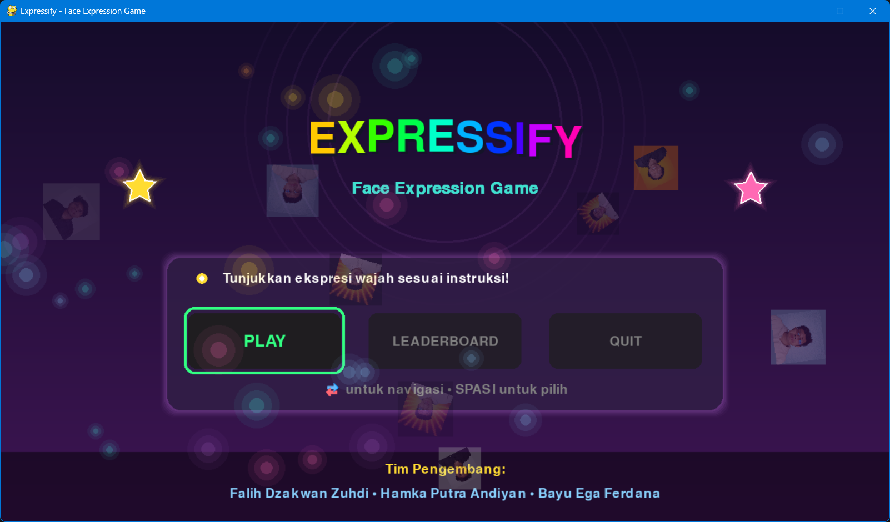
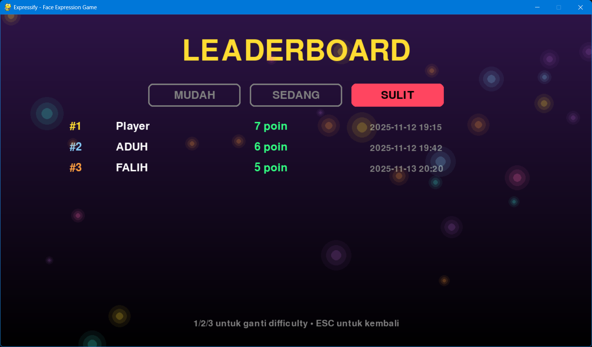
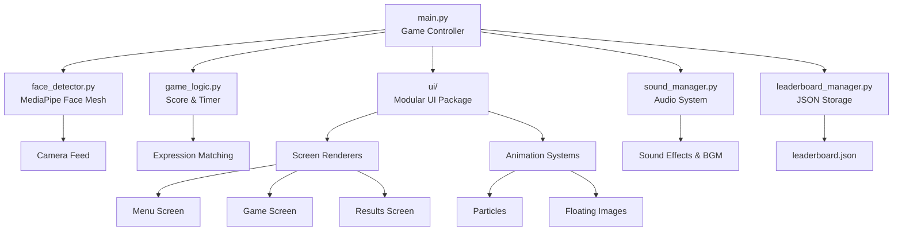
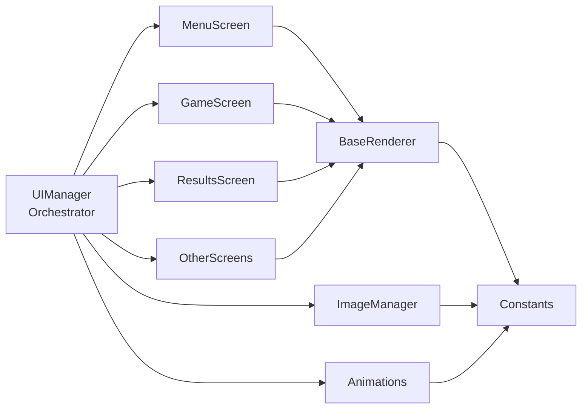
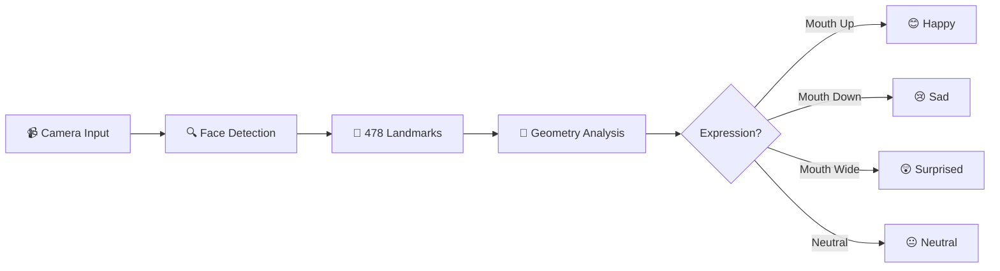

# 🎮 Expressify - Face Expression Game

<div align="center">

[](https://www.python.org/)
[](https://google.github.io/mediapipe/)
[](https://opencv.org/)
[](https://www.pygame.org/)
[](LICENSE)

**Permainan interaktif untuk mendeteksi ekspresi wajah secara real-time!**

[Fitur](#-fitur) •
[Instalasi](#-instalasi) •
[Cara Bermain](#-cara-bermain) •
[Dokumentasi](#-dokumentasi) •
[Tim](#-tim-pengembang)

</div>

---

## 📝 Deskripsi Project

**Expressify** adalah permainan interaktif berbasis deteksi ekspresi wajah yang menantang pemain untuk menunjukkan berbagai ekspresi dengan cepat dan akurat! Dalam waktu yang terbatas, Anda akan diberi instruksi acak seperti **senyum lebar** 😊, **cemberut sedih** 😢, **kaget maksimal** 😲, atau **wajah datar** 😐. Setiap ekspresi yang benar akan menambah skor Anda!

<div align="center">

### 🎯 Preview Game
**https://youtu.be/yy_7H83gZ9U**

| Menu Utama                    | Gameplay                          | Leaderboard                                 |
| ----------------------------- | --------------------------------- | ------------------------------------------- |
|  |  |  |

</div>

### 🎓 Latar Belakang Akademik

Game ini dikembangkan sebagai **Tugas Besar** untuk mata kuliah **Sistem Teknologi Multimedia** menggunakan teknologi **MediaPipe Face Mesh** untuk deteksi landmark wajah tanpa deep learning. Project ini mendemonstrasikan implementasi Computer Vision dan Human-Computer Interaction dalam bentuk aplikasi interaktif yang menarik.

## ✨ Fitur

### 🎮 Gameplay

- 🎯 **Real-time Face Detection** - Deteksi wajah instan menggunakan MediaPipe Face Mesh (478 landmark points)
- 😊 **4 Ekspresi Berbeda** - Happy, Sad, Surprised, Neutral dengan deteksi akurat
- 🎚️ **3 Tingkat Kesulitan**
  - 🟢 **Easy**: 30 detik, 2 ekspresi
  - 🟡 **Medium**: 20 detik, 4 ekspresi
  - 🔴 **Hard**: 15 detik, 4 ekspresi (cooldown lebih cepat)

### 🏆 Sistem Kompetisi

- 📊 **Leaderboard System** - Simpan top 10 scores untuk setiap tingkat kesulitan
- 👤 **Player Profiles** - Nama pemain kustom (maksimal 15 karakter)
- 📈 **Performance Metrics** - Feedback performa berdasarkan persentase skor

### 🎨 User Experience

- 🖼️ **UI Interaktif** - Antarmuka modern dengan Pygame & animasi smooth
- 🎵 **Audio Support** - Sound effects & background music (optional)
- 🎨 **Visual Effects** - Particle system, gradient backgrounds, glow effects
- 🌈 **Rainbow Animations** - Animated title dengan warna dinamis

### 🛠️ Teknis

- ⚡ **Optimized Performance** - Target 30 FPS untuk gameplay yang smooth
- 🎮 **Intuitive Controls** - Navigasi keyboard yang mudah dipahami
- 💾 **Data Persistence** - Leaderboard tersimpan di JSON
- 🔧 **Modular Architecture** - Clean code dengan separation of concerns
- 📦 **Package Structure** - UI components organized in modular package
- 🎨 **Reusable Components** - Shared rendering utilities across screens

<div align="center">

## 🎭 Deteksi Ekspresi

<table>
<tr>
<td align="center" width="25%">
<br>
<b>😊 Happy</b><br>
<sub>Sudut mulut naik</sub>
</td>
<td align="center" width="25%">
<br>
<b>😢 Sad</b><br>
<sub>Sudut mulut turun</sub>
</td>
<td align="center" width="25%">
<br>
<b>😲 Surprised</b><br>
<sub>Mulut & mata terbuka</sub>
</td>
<td align="center" width="25%">
<br>
<b>😐 Neutral</b><br>
<sub>Wajah rileks</sub>
</td>
</tr>
</table>

</div>

## 🧑‍🤝‍🧑 Tim Pengembang

<div align="center">

| 👨‍💻 Developer            | 🎯 Role                         | 📧 Contact                                 |
| ----------------------- | ------------------------------- | ------------------------------------------ |
| **Hamka Putra Andiyan** | Lead Developer & Face Detection | [@hamka](https://github.com/HamkaHPA)      |
| **Bayu Ega Ferdana**    | Game Logic & Sound System       | [@bayu](https://github.com/Yuuggaa)        |
| **Falih Dzakwan Zuhdi** | Integration & UI Design         | [@falih](https://github.com/falihdzakwanz) |

</div>

---

## 🔧 Teknologi yang Digunakan

<div align="center">

| Teknologi                                                                                                           | Versi   | Deskripsi                             |
| ------------------------------------------------------------------------------------------------------------------- | ------- | ------------------------------------- |
|           | 3.8+    | Core programming language             |
|  | 0.10.14 | Face Mesh untuk deteksi 478 landmarks |
|         | 4.10.0  | Video capture & image processing      |
|           | 2.6.0   | Game engine & UI rendering            |
|            | 1.26.4  | Numerical computations                |

</div>

### 🏗️ Arsitektur Sistem



#### 🎨 UI Module Architecture



## 📋 Requirements

### System Requirements

- 💻 **OS**: Windows 10/11, macOS, Linux
- 🎥 **Webcam**: Built-in or external (minimum 480p)
- 🐍 **Python**: 3.8 atau lebih baru
- 💾 **Storage**: ~500 MB untuk dependencies
- 🖥️ **RAM**: Minimum 4 GB (8 GB recommended)

### Python Dependencies

Semua dependencies sudah terdaftar di `requirements.txt`:

```txt
mediapipe==0.10.14      # Face landmark detection
opencv-python==4.10.0.84 # Video processing
numpy==1.26.4            # Numerical operations
pygame==2.6.0            # Game engine & UI
Pillow==10.4.0           # Image processing
```

---

## 🚀 Instalasi

### ⚡ Quick Start (Recommended)

<details open>
<summary><b>🪟 Windows (PowerShell/CMD)</b></summary>

```bash
# 1. Clone repository
git clone https://github.com/Yuuggaa/Expressify.git
cd Expressify

# 2. Jalankan installer otomatis
setup.bat

# 3. Jalankan game
venv\Scripts\activate
python src\main.py
```

</details>

<details>
<summary><b>🐧 Linux / 🍎 macOS</b></summary>

```bash
# 1. Clone repository
git clone https://github.com/Yuuggaa/Expressify.git
cd Expressify

# 2. Jalankan installer otomatis
chmod +x setup.sh
./setup.sh

# 3. Jalankan game
source venv/bin/activate
python src/main.py
```

</details>

### 🔧 Manual Installation

<details>
<summary>Click to expand manual installation steps</summary>

```bash
# 1. Clone repository
git clone https://github.com/Yuuggaa/Expressify.git
cd Expressify

# 2. Buat virtual environment
python -m venv venv

# 3. Aktifkan virtual environment
# Windows:
venv\Scripts\activate
# Linux/Mac:
source venv/bin/activate

# 4. Upgrade pip
python -m pip install --upgrade pip

# 5. Install dependencies
pip install -r requirements.txt

# 6. Jalankan game
python src/main.py
```

</details>

### 🎵 Optional: Audio Assets

Untuk pengalaman terbaik, tambahkan file audio di folder `assets/sounds/`:

- `bgm.wav` - Background music untuk menu
- `click.wav` - Sound effect untuk button click
- `high_score.wav` - Sound untuk skor tinggi
- `true_answer.wav` - Sound untuk jawaban benar

> **Note**: Game akan berjalan normal tanpa file audio (graceful fallback)

---

## 🎮 Cara Menjalankan Game

### 🚀 Quick Run

```bash
# Pastikan virtual environment aktif
# Windows:
venv\Scripts\activate

# Linux/Mac:
source venv/bin/activate

# Jalankan game
python src/main.py
```

### 🎯 Kontrol Game

<div align="center">

| Tombol      | Fungsi                 | Screen      |
| ----------- | ---------------------- | ----------- |
| `←` `→`     | Navigasi horizontal    | Menu        |
| `↑` `↓`     | Navigasi vertikal      | Difficulty  |
| `SPACE`     | Konfirmasi / Main lagi | All         |
| `ENTER`     | Submit nama            | Name Input  |
| `ESC`       | Kembali / Keluar       | All         |
| `1` `2` `3` | Ganti difficulty       | Leaderboard |
| `BACKSPACE` | Hapus karakter         | Name Input  |

</div>

---

## 🎯 Cara Bermain

### 📖 Game Flow

```
🏠 Menu Utama → 👤 Input Nama → 🎚️ Pilih Kesulitan → 🎮 Gameplay → 📊 Results → 🏆 Leaderboard
```

### 🎮 Step by Step

1. **🏠 Menu Utama**

   - Pilih **PLAY** untuk mulai bermain
   - Pilih **LEADERBOARD** untuk melihat top scores
   - Pilih **QUIT** untuk keluar

2. **👤 Input Nama**

   - Masukkan nama Anda (maksimal 15 karakter)
   - Nama akan muncul di leaderboard
   - Tekan `ENTER` untuk lanjut atau `ESC` untuk skip

3. **🎚️ Pilih Kesulitan**

   - 🟢 **MUDAH**: 30 detik, 2 ekspresi (Happy & Sad)
   - 🟡 **SEDANG**: 20 detik, 4 ekspresi (semua)
   - 🔴 **SULIT**: 15 detik, 4 ekspresi (cooldown cepat)

4. **🎮 Gameplay**

   - Lihat instruksi ekspresi di layar
   - Tunjukkan ekspresi yang diminta ke kamera
   - Skor bertambah jika ekspresi benar
   - Perhatikan timer - waktu terus berjalan!

5. **📊 Results**

   - Lihat skor akhir dan performa Anda
   - Rating otomatis berdasarkan persentase:
     - 🏆 **Rank S** (80%+): LUAR BIASA! ⭐⭐⭐⭐⭐
     - 🥇 **Rank A** (60-79%): BAGUS SEKALI! ⭐⭐⭐⭐
     - 🥈 **Rank B** (40-59%): CUKUP BAIK! ⭐⭐⭐
     - 🥉 **Rank C** (<40%): TERUS BERLATIH! ⭐

6. **🏆 Leaderboard**
   - Top 10 pemain untuk setiap difficulty
   - 🥇 Gold - 🥈 Silver - 🥉 Bronze medals
   - Tekan `1`, `2`, `3` untuk ganti difficulty

### 💡 Tips & Tricks

<details>
<summary><b>🎯 Cara Mendapat Skor Tinggi</b></summary>

- ✅ **Pastikan pencahayaan baik** - Hindari backlight
- ✅ **Posisikan wajah di tengah** - Jaga jarak ~50cm dari kamera
- ✅ **Ekspresi yang jelas** - Lebih ekspresif = lebih mudah terdeteksi
- ✅ **Fokus pada instruksi** - Jangan terlalu cepat berganti ekspresi
- ✅ **Latihan mode Easy dulu** - Pahami mekanisme sebelum Hard mode

</details>

---

## 📁 Struktur Project

```
Expressify/
│
├── 📂 src/                          # Source code utama
│   ├── 🎮 main.py                   # Entry point & game controller
│   ├── 👁️ face_detector.py          # MediaPipe face detection
│   ├── 🎯 game_logic.py             # Game rules & scoring
│   ├── 🔊 sound_manager.py          # Audio system
│   ├── 🏆 leaderboard_manager.py    # Score persistence
│   │
│   └── 📂 ui/                       # Modular UI components
│       ├── 🎨 ui_manager.py         # Main UI orchestrator
│       ├── 🎭 constants.py          # Colors, fonts, dimensions
│       ├── 🖌️ base_renderer.py      # Base rendering utilities
│       ├── ✨ animations.py         # Particle & animation systems
│       ├── 🖼️ image_manager.py      # Expression image loader
│       ├── 🏠 menu_screen.py        # Main menu renderer
│       ├── 🎮 game_screen.py        # Game screen renderer
│       ├── 📊 results_screen.py     # Results screen renderer
│       ├── 🎚️ other_screens.py      # Difficulty, leaderboard, name input
│       ├── 📖 README.md             # UI module documentation
│       ├── 📐 ARCHITECTURE.md       # UI architecture diagram
│       └── 📦 __init__.py           # Package initialization
│
├── 📂 assets/                       # Game assets
│   ├── 🔊 sounds/                   # Audio files (optional)
│   │   ├── bgm.wav
│   │   ├── click.wav
│   │   ├── start.wav
│   │   ├── true_answer.wav
│   │   ├── high_score.wav
│   │   ├── botHigh_score.wav
│   │   ├── upLow_score.wav
│   │   └── low_score.wav
│   ├── 🖼️ images/                   # UI icons
│   │   ├── icon.ico                 # Application icon (Windows .exe)
│   │   ├── exchange.png             # Navigation icon
│   │   └── up-down.png              # Selection icon
│   └── 📸 photo/                    # Expression reference images
│       ├── Senang.png               # Happy expression
│       ├── Sedih.png                # Sad expression
│       ├── Kaget.png                # Surprised expression
│       └── Datar.png                # Neutral expression
│
├── 📂 docs/                         # Dokumentasi tambahan
│   ├── BUILD_GUIDE.md               # Build executable guide
│   ├── FEATURES.md                  # Detailed features
│   ├── GAME_FLOW.md                 # Game flow diagram
│   └── SOUND_GUIDE.md               # Audio setup guide
│
├── 📂 reports/                      # Project reports & documentation
│   ├── 📄 report.tex                # LaTeX project report
│   ├── 📚 Referensi.bib             # Bibliography references
│   ├── 📄 Readme.MD                 # Template usage guide
│   ├── 📜 LICENSE                   # Template license
│   └── 📂 Figure/                   # Report figures & images
│
├── 📂 scripts/                      # Build & utility scripts
│   ├── 🔨 build_exe.bat             # Build portable .exe (Windows)
│   ├── 🔨 build_exe_dir.bat         # Build install folder (Windows)
│   ├── 🔨 build_both.bat            # Build both versions (Windows)
│   └── 🎨 create_icon.py            # Generate icon.ico from PNG
│
├── 📄 leaderboard.json              # Leaderboard data (auto-generated)
├── 📄 requirements.txt              # Python dependencies
├── 🚀 setup.bat                     # Windows installer
├── 🚀 setup.sh                      # Linux/Mac installer
├── 📋 .gitignore                    # Git ignore rules
├── 📖 README.md                     # Project documentation (this file)
├── 📖 DOWNLOAD_README.md            # Download & usage guide for .exe
├── 📜 LICENSE                       # MIT License
└── 🎮 QUICKSTART.md                 # Quick start guide
```

### 🏗️ UI Module Structure (Modular Architecture)

```
src/ui/
├── ui_manager.py         # Main orchestrator - coordinates all UI components
├── constants.py          # Configuration (Colors, Dimensions, FontManager)
├── base_renderer.py      # Reusable rendering utilities (gradients, text effects)
├── animations.py         # Animation systems (ParticleSystem, FloatingImages, Confetti)
├── image_manager.py      # Expression image loading & rendering
├── menu_screen.py        # Main menu screen renderer
├── game_screen.py        # Game playing screen renderer
├── results_screen.py     # Results & ranking screen renderer
└── other_screens.py      # Additional screens (Difficulty, Leaderboard, NameInput)
```

**Key Features of Modular UI:**

- ✅ **Separation of Concerns** - Each module has single responsibility
- ✅ **Maintainability** - Easy to update individual screens
- ✅ **Reusability** - Shared utilities in base_renderer
- ✅ **Scalability** - Simple to add new screens or features
- ✅ **Clean Code** - Well-organized with clear dependencies

---

## 🔍 Cara Kerja Deteksi Ekspresi

### 🧠 Algoritma Detection

<div align="center">



</div>

### 📊 Technical Details

Game ini menggunakan **MediaPipe Face Mesh** yang mendeteksi **478 landmark points** pada wajah secara real-time:

#### 1. 🔍 **Deteksi Landmark**

```python
# Key landmarks used:
- Mouth: landmarks 61, 291 (corners), 13, 14 (lips)
- Eyebrows: landmarks 70, 63 (left), 300, 293 (right)
- Eyes: landmarks 159, 145 (left), 386, 374 (right)
```

#### 2. 📐 **Analisis Geometri**

- **Happy** 😊:

  - Mouth corners elevated (y-position)
  - Slight mouth opening
  - Distance ratio: `mouth_width / mouth_height > 2.0`

- **Sad** 😢:

  - Mouth corners depressed
  - Eyebrows lowered
  - Mouth curvature negative

- **Surprised** 😲:

  - Mouth height > 20 pixels
  - Eyes wide open (eyebrow distance increased)
  - Jaw dropped significantly

- **Neutral** 😐:
  - Default state
  - Minimal facial muscle activation
  - Balanced landmark positions

#### 3. ✅ **Klasifikasi**

```python
# Confidence thresholds
HAPPY_THRESHOLD = 0.02      # Mouth corner elevation
SAD_THRESHOLD = -0.02       # Mouth corner depression
SURPRISED_THRESHOLD = 20    # Mouth height in pixels
```

### 🎯 Akurasi & Performance

| Metrik              | Value      |
| ------------------- | ---------- |
| Detection FPS       | ~30 FPS    |
| Landmark Detection  | 478 points |
| Expression Accuracy | ~85-90%    |
| Latency             | <50ms      |

---

## 🐛 Troubleshooting

### ❌ Common Issues

<details>
<summary><b>🎥 Kamera tidak terdeteksi</b></summary>

**Problem**: `Failed to open camera` error

**Solutions**:

```bash
# 1. Check kamera tidak digunakan aplikasi lain
# Tutup Zoom, Teams, Skype, dll

# 2. Restart aplikasi
python src/main.py

# 3. Check permission kamera
# Windows: Settings → Privacy → Camera
# Mac: System Preferences → Security & Privacy → Camera

# 4. Test kamera dengan script sederhana
python -c "import cv2; cap = cv2.VideoCapture(0); print('OK' if cap.isOpened() else 'FAIL')"
```

</details>

<details>
<summary><b>📦 Dependencies error</b></summary>

**Problem**: `ModuleNotFoundError` atau import errors

**Solutions**:

```bash
# 1. Pastikan venv aktif
# Windows:
venv\Scripts\activate
# Linux/Mac:
source venv/bin/activate

# 2. Reinstall dependencies
pip install --upgrade -r requirements.txt

# 3. Clear cache dan reinstall
pip cache purge
pip install --force-reinstall -r requirements.txt

# 4. Check Python version (min 3.8)
python --version
```

</details>

<details>
<summary><b>🐍 Virtual environment issues</b></summary>

**Problem**: venv corrupted atau tidak bisa aktif

**Solutions**:

```bash
# 1. Hapus venv lama
# Windows:
rmdir /s venv
# Linux/Mac:
rm -rf venv

# 2. Buat venv baru
python -m venv venv

# 3. Aktifkan dan install
# Windows:
venv\Scripts\activate
# Linux/Mac:
source venv/bin/activate

pip install -r requirements.txt
```

</details>

<details>
<summary><b>🎮 Game lag atau FPS rendah</b></summary>

**Problem**: Performance issues

**Solutions**:

- ✅ Close aplikasi lain yang berat
- ✅ Update graphics driver
- ✅ Kurangi resolusi kamera (edit di `main.py`)
- ✅ Disable particle effects (comment di `ui_manager.py`)
- ✅ Check CPU usage (<80% recommended)

</details>

<details>
<summary><b>🔊 Audio tidak keluar</b></summary>

**Problem**: No sound atau audio error

**Solutions**:

```bash
# 1. Check file audio ada di assets/sounds/
ls assets/sounds/  # Linux/Mac
dir assets\sounds\  # Windows

# 2. Test pygame audio
python -c "import pygame; pygame.mixer.init(); print('OK')"

# 3. Game berjalan normal tanpa audio (graceful fallback)
# Pastikan file .wav format PCM
```

</details>

<details>
<summary><b>😐 Ekspresi tidak terdeteksi akurat</b></summary>

**Problem**: False positives atau ekspresi salah

**Solutions**:

- ✅ **Pencahayaan**: Pastikan ruangan cukup terang
- ✅ **Posisi**: Jaga wajah di tengah frame
- ✅ **Jarak**: 40-60 cm dari kamera ideal
- ✅ **Background**: Hindari background yang ramai
- ✅ **Ekspresi**: Buat ekspresi lebih jelas dan ekstrem
- ✅ **Kacamata**: Lepas jika deteksi terganggu

</details>

---

## 📚 Dokumentasi Lengkap

### 📖 Additional Docs

- 📋 [QUICKSTART.md](QUICKSTART.md) - Quick start guide
- ✨ [FEATURES.md](docs/FEATURES.md) - Detailed features list
- 🎮 [GAME_FLOW.md](docs/GAME_FLOW.md) - Game state diagram
- 🔊 [SOUND_GUIDE.md](docs/SOUND_GUIDE.md) - Audio setup guide
- 🏗️ [BUILD_GUIDE.md](docs/BUILD_GUIDE.md) - Build executable guide

### 📥 Download Executable

**Mau main tanpa install Python?**

Download versi executable (.exe):
- 💾 [Expressify v1.0 - Windows](https://github.com/Yuuggaa/Expressify/releases)
- 📖 [Download Guide](DOWNLOAD_README.md)

Tinggal download, double-click, dan main! 🎮

### 🔨 Build Your Own Executable

Ingin build sendiri? Lihat panduan lengkap di [BUILD_GUIDE.md](docs/BUILD_GUIDE.md)

**Quick Build (Windows):**
```bash
# Build portable .exe (single file)
.\scripts\build_exe.bat

# Build install version (folder)
.\scripts\build_exe_dir.bat

# Build both versions at once
.\scripts\build_both.bat
```

**Output:**
- `dist/Expressify.exe` - Portable version (~150-200 MB)
- `dist/Expressify/` - Install version (~180 MB unzipped)
- `dist/Expressify.zip` - Zipped install version (auto-created)

### 🔗 External Resources

- 📘 [MediaPipe Face Mesh Documentation](https://google.github.io/mediapipe/solutions/face_mesh.html)
- 📗 [OpenCV Python Tutorials](https://docs.opencv.org/4.x/d6/d00/tutorial_py_root.html)
- 📙 [Pygame Documentation](https://www.pygame.org/docs/)
- 📕 [NumPy User Guide](https://numpy.org/doc/stable/user/index.html)

---

## 🤝 Contributing

Contributions are welcome! Please feel free to submit a Pull Request.

### Development Setup

```bash
# 1. Fork & clone
git clone https://github.com/YOUR_USERNAME/Expressify.git

# 2. Create branch
git checkout -b feature/amazing-feature

# 3. Make changes & commit
git commit -m "Add amazing feature"

# 4. Push & create PR
git push origin feature/amazing-feature
```

### Code Style

- Follow PEP 8 guidelines
- Add docstrings to functions
- Use type hints where applicable
- Comment complex logic
- Write descriptive commit messages

---

## 📄 License

This project is created for academic purposes (Tugas Besar Sistem Teknologi Multimedia).

**MIT License** - feel free to use for educational purposes.

---

## 📞 Contact & Support

<div align="center">

### 💬 Need Help?

[](https://github.com/Yuuggaa/Expressify/issues)
[](https://github.com/Yuuggaa/Expressify/discussions)

</div>

### 📧 Team Contacts

- **Hamka Putra Andiyan**: [GitHub](https://github.com/HamkaHPA)
- **Bayu Ega Ferdana**: [GitHub](https://github.com/Yuuggaa)
- **Falih Dzakwan Zuhdi**: [GitHub](https://github.com/falihdzakwanz)

---

<div align="center">

## ⭐ Show Your Support

Jika project ini membantu Anda, berikan ⭐ di GitHub!

[](https://github.com/Yuuggaa/Expressify)
[](https://github.com/Yuuggaa/Expressify/fork)

---

### 🎮 Expressify

**Tim Expressify**

_Hamka Putra Andiyan • Bayu Ega Ferdana • Falih Dzakwan Zuhdi_

**Sistem Teknologi Multimedia - 2025**

[⬆ Back to Top](#-expressify---face-expression-game)

</div>
