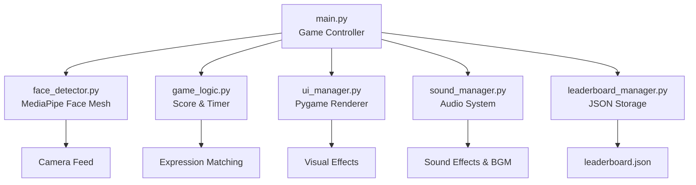

# 🎮 Expressify - Face Expression Game

<div align="center">

[](https://www.python.org/)
[](https://google.github.io/mediapipe/)
[](https://opencv.org/)
[](https://www.pygame.org/)
[](LICENSE)

**Permainan interaktif untuk mendeteksi ekspresi wajah secara real-time!**

[Fitur](#-fitur) •
[Instalasi](#-instalasi) •
[Cara Bermain](#-cara-bermain) •
[Dokumentasi](#-dokumentasi) •
[Tim](#-tim-pengembang)

</div>

---

## 📝 Deskripsi Project

**Expressify** adalah permainan interaktif berbasis deteksi ekspresi wajah yang menantang pemain untuk menunjukkan berbagai ekspresi dengan cepat dan akurat! Dalam waktu yang terbatas, Anda akan diberi instruksi acak seperti **senyum lebar** 😊, **cemberut sedih** 😢, **kaget maksimal** 😲, atau **wajah datar** 😐. Setiap ekspresi yang benar akan menambah skor Anda!

<div align="center">

### 🎯 Preview Game

| Menu Utama | Gameplay | Leaderboard |
|------------|----------|-------------|
|  |  |  |

</div>

### 🎓 Latar Belakang Akademik

Game ini dikembangkan sebagai **Tugas Besar** untuk mata kuliah **Sistem Teknologi Multimedia** menggunakan teknologi **MediaPipe Face Mesh** untuk deteksi landmark wajah tanpa deep learning. Project ini mendemonstrasikan implementasi Computer Vision dan Human-Computer Interaction dalam bentuk aplikasi interaktif yang menarik.

## ✨ Fitur

### 🎮 Gameplay
- 🎯 **Real-time Face Detection** - Deteksi wajah instan menggunakan MediaPipe Face Mesh (478 landmark points)
- 😊 **4 Ekspresi Berbeda** - Happy, Sad, Surprised, Neutral dengan deteksi akurat
- 🎚️ **3 Tingkat Kesulitan** 
  - 🟢 **Easy**: 30 detik, 2 ekspresi
  - 🟡 **Medium**: 20 detik, 4 ekspresi  
  - 🔴 **Hard**: 15 detik, 4 ekspresi (cooldown lebih cepat)

### 🏆 Sistem Kompetisi
- 📊 **Leaderboard System** - Simpan top 10 scores untuk setiap tingkat kesulitan
- 👤 **Player Profiles** - Nama pemain kustom (maksimal 15 karakter)
- 📈 **Performance Metrics** - Feedback performa berdasarkan persentase skor

### 🎨 User Experience
- 🖼️ **UI Interaktif** - Antarmuka modern dengan Pygame & animasi smooth
- 🎵 **Audio Support** - Sound effects & background music (optional)
- 🎨 **Visual Effects** - Particle system, gradient backgrounds, glow effects
- 🌈 **Rainbow Animations** - Animated title dengan warna dinamis

### 🛠️ Teknis
- ⚡ **Optimized Performance** - Target 30 FPS untuk gameplay yang smooth
- 🎮 **Intuitive Controls** - Navigasi keyboard yang mudah dipahami
- 💾 **Data Persistence** - Leaderboard tersimpan di JSON
- 🔧 **Modular Architecture** - Clean code dengan separation of concerns

<div align="center">

## 🎭 Deteksi Ekspresi

<table>
<tr>
<td align="center" width="25%">
<br>
<b>😊 Happy</b><br>
<sub>Sudut mulut naik</sub>
</td>
<td align="center" width="25%">
<br>
<b>😢 Sad</b><br>
<sub>Sudut mulut turun</sub>
</td>
<td align="center" width="25%">
<br>
<b>😲 Surprised</b><br>
<sub>Mulut & mata terbuka</sub>
</td>
<td align="center" width="25%">
<br>
<b>😐 Neutral</b><br>
<sub>Wajah rileks</sub>
</td>
</tr>
</table>

</div>

## 🧑‍🤝‍🧑 Tim Pengembang

<div align="center">

| 👨‍💻 Developer | 🎯 Role | 📧 Contact |
|--------------|---------|-----------|
| **Hamka Putra Andiyan** | Lead Developer & Face Detection | [@hamka](https://github.com/HamkaHPA) |
| **Bayu Ega Ferdana** | Game Logic & Sound System | [@bayu](https://github.com/Yuuggaa) |
| **Falih Dzakwan Zuhdi** | Integration & UI Design | [@falih](https://github.com/falihdzakwanz) |

</div>

---

## 🔧 Teknologi yang Digunakan

<div align="center">

| Teknologi | Versi | Deskripsi |
|-----------|-------|-----------|
|  | 3.8+ | Core programming language |
|  | 0.10.14 | Face Mesh untuk deteksi 478 landmarks |
|  | 4.10.0 | Video capture & image processing |
|  | 2.6.0 | Game engine & UI rendering |
|  | 1.26.4 | Numerical computations |

</div>

### 🏗️ Arsitektur Sistem



## 📋 Requirements

### System Requirements
- 💻 **OS**: Windows 10/11, macOS, Linux
- 🎥 **Webcam**: Built-in or external (minimum 480p)
- 🐍 **Python**: 3.8 atau lebih baru
- 💾 **Storage**: ~500 MB untuk dependencies
- 🖥️ **RAM**: Minimum 4 GB (8 GB recommended)

### Python Dependencies

Semua dependencies sudah terdaftar di `requirements.txt`:

```txt
mediapipe==0.10.14      # Face landmark detection
opencv-python==4.10.0.84 # Video processing
numpy==1.26.4            # Numerical operations
pygame==2.6.0            # Game engine & UI
Pillow==10.4.0           # Image processing
```

---

## 🚀 Instalasi

### ⚡ Quick Start (Recommended)

<details open>
<summary><b>🪟 Windows (PowerShell/CMD)</b></summary>

```bash
# 1. Clone repository
git clone https://github.com/Yuuggaa/Expressify.git
cd Expressify

# 2. Jalankan installer otomatis
setup.bat

# 3. Jalankan game
venv\Scripts\activate
python src\main.py
```

</details>

<details>
<summary><b>🐧 Linux / 🍎 macOS</b></summary>

```bash
# 1. Clone repository
git clone https://github.com/Yuuggaa/Expressify.git
cd Expressify

# 2. Jalankan installer otomatis
chmod +x setup.sh
./setup.sh

# 3. Jalankan game
source venv/bin/activate
python src/main.py
```

</details>

### 🔧 Manual Installation

<details>
<summary>Click to expand manual installation steps</summary>

```bash
# 1. Clone repository
git clone https://github.com/Yuuggaa/Expressify.git
cd Expressify

# 2. Buat virtual environment
python -m venv venv

# 3. Aktifkan virtual environment
# Windows:
venv\Scripts\activate
# Linux/Mac:
source venv/bin/activate

# 4. Upgrade pip
python -m pip install --upgrade pip

# 5. Install dependencies
pip install -r requirements.txt

# 6. Jalankan game
python src/main.py
```

</details>

### 🎵 Optional: Audio Assets

Untuk pengalaman terbaik, tambahkan file audio di folder `assets/sounds/`:
- `bgm.wav` - Background music untuk menu
- `click.wav` - Sound effect untuk button click
- `high_score.wav` - Sound untuk skor tinggi
- `true_answer.wav` - Sound untuk jawaban benar

> **Note**: Game akan berjalan normal tanpa file audio (graceful fallback)

---

## 🎮 Cara Menjalankan Game

### 🚀 Quick Run

```bash
# Pastikan virtual environment aktif
# Windows:
venv\Scripts\activate

# Linux/Mac:
source venv/bin/activate

# Jalankan game
python src/main.py
```

### 🎯 Kontrol Game

<div align="center">

| Tombol | Fungsi | Screen |
|--------|--------|--------|
| `←` `→` | Navigasi horizontal | Menu |
| `↑` `↓` | Navigasi vertikal | Difficulty |
| `SPACE` | Konfirmasi / Main lagi | All |
| `ENTER` | Submit nama | Name Input |
| `ESC` | Kembali / Keluar | All |
| `1` `2` `3` | Ganti difficulty | Leaderboard |
| `BACKSPACE` | Hapus karakter | Name Input |

</div>

---

## 🎯 Cara Bermain

### 📖 Game Flow

```
🏠 Menu Utama → 👤 Input Nama → 🎚️ Pilih Kesulitan → 🎮 Gameplay → 📊 Results → 🏆 Leaderboard
```

### 🎮 Step by Step

1. **🏠 Menu Utama**
   - Pilih **PLAY** untuk mulai bermain
   - Pilih **LEADERBOARD** untuk melihat top scores
   - Pilih **QUIT** untuk keluar

2. **👤 Input Nama** 
   - Masukkan nama Anda (maksimal 15 karakter)
   - Nama akan muncul di leaderboard
   - Tekan `ENTER` untuk lanjut atau `ESC` untuk skip

3. **🎚️ Pilih Kesulitan**
   - 🟢 **MUDAH**: 30 detik, 2 ekspresi (Happy & Sad)
   - 🟡 **SEDANG**: 20 detik, 4 ekspresi (semua)
   - 🔴 **SULIT**: 15 detik, 4 ekspresi (cooldown cepat)

4. **🎮 Gameplay**
   - Lihat instruksi ekspresi di layar
   - Tunjukkan ekspresi yang diminta ke kamera
   - Skor bertambah jika ekspresi benar
   - Perhatikan timer - waktu terus berjalan!

5. **📊 Results**
   - Lihat skor akhir dan performa Anda
   - Rating otomatis berdasarkan persentase:
     - 🌟 **80%+**: LUAR BIASA!
     - ⭐ **60-79%**: BAGUS SEKALI!
     - ✨ **40-59%**: CUKUP BAIK!
     - 💪 **<40%**: TERUS BERLATIH!

6. **🏆 Leaderboard**
   - Top 10 pemain untuk setiap difficulty
   - 🥇 Gold - 🥈 Silver - 🥉 Bronze medals
   - Tekan `1`, `2`, `3` untuk ganti difficulty

### 💡 Tips & Tricks

<details>
<summary><b>🎯 Cara Mendapat Skor Tinggi</b></summary>

- ✅ **Pastikan pencahayaan baik** - Hindari backlight
- ✅ **Posisikan wajah di tengah** - Jaga jarak ~50cm dari kamera
- ✅ **Ekspresi yang jelas** - Lebih ekspresif = lebih mudah terdeteksi
- ✅ **Fokus pada instruksi** - Jangan terlalu cepat berganti ekspresi
- ✅ **Latihan mode Easy dulu** - Pahami mekanisme sebelum Hard mode

</details>

---

## 📁 Struktur Project

```
Expressify/
│
├── 📂 src/                          # Source code utama
│   ├── 🎮 main.py                   # Entry point & game controller
│   ├── 👁️ face_detector.py          # MediaPipe face detection
│   ├── 🎯 game_logic.py             # Game rules & scoring
│   ├── 🎨 ui_manager.py             # Pygame UI & rendering
│   ├── 🔊 sound_manager.py          # Audio system
│   └── 🏆 leaderboard_manager.py    # Score persistence
│
├── 📂 assets/                       # Game assets
│   ├── 🔊 sounds/                   # Audio files (optional)
│   │   ├── bgm.wav
│   │   ├── click.wav
│   │   └── true_answer.wav
│   ├── 🖼️ images/                   # UI icons
│   │   ├── exchange.png
│   │   └── up-down.png
│   └── 📸 photo/                    # Documentation images
│       ├── Senang.png
│       ├── Sedih.png
│       ├── Kaget.png
│       └── Datar.png
│
├── 📂 docs/                         # Dokumentasi tambahan
│   ├── FEATURES.md
│   ├── GAME_FLOW.md
│   └── SOUND_GUIDE.md
│
├── 📄 requirements.txt              # Python dependencies
├── 🚀 setup.bat                     # Windows installer
├── 🚀 setup.sh                      # Linux/Mac installer
├── 📋 .gitignore                    # Git ignore rules
├── 📖 README.md                     # Project documentation
└── 🎮 QUICKSTART.md                 # Quick start guide
```

---

## 🔍 Cara Kerja Deteksi Ekspresi

### 🧠 Algoritma Detection

```mermaid
graph LR
    A[📹 Camera Input] --> B[🔍 Face Detection]
    B --> C[📍 478 Landmarks]
    C --> D[📏 Geometry Analysis]
    D --> E{Expression?}
    E -->|Mouth Up| F[😊 Happy]
    E -->|Mouth Down| G[😢 Sad]
    E -->|Mouth Wide| H[😲 Surprised]
    E -->|Neutral| I[😐 Neutral]
```

<div align="center">



</div>

### 📊 Technical Details

Game ini menggunakan **MediaPipe Face Mesh** yang mendeteksi **478 landmark points** pada wajah secara real-time:

#### 1. 🔍 **Deteksi Landmark**
```python
# Key landmarks used:
- Mouth: landmarks 61, 291 (corners), 13, 14 (lips)
- Eyebrows: landmarks 70, 63 (left), 300, 293 (right)  
- Eyes: landmarks 159, 145 (left), 386, 374 (right)
```

#### 2. 📐 **Analisis Geometri**
- **Happy** 😊: 
  - Mouth corners elevated (y-position)
  - Slight mouth opening
  - Distance ratio: `mouth_width / mouth_height > 2.0`

- **Sad** 😢:
  - Mouth corners depressed
  - Eyebrows lowered
  - Mouth curvature negative

- **Surprised** 😲:
  - Mouth height > 20 pixels
  - Eyes wide open (eyebrow distance increased)
  - Jaw dropped significantly

- **Neutral** 😐:
  - Default state
  - Minimal facial muscle activation
  - Balanced landmark positions

#### 3. ✅ **Klasifikasi**
```python
# Confidence thresholds
HAPPY_THRESHOLD = 0.02      # Mouth corner elevation
SAD_THRESHOLD = -0.02       # Mouth corner depression  
SURPRISED_THRESHOLD = 20    # Mouth height in pixels
```

### 🎯 Akurasi & Performance

| Metrik | Value |
|--------|-------|
| Detection FPS | ~30 FPS |
| Landmark Detection | 478 points |
| Expression Accuracy | ~85-90% |
| Latency | <50ms |

---

## 🐛 Troubleshooting

### ❌ Common Issues

<details>
<summary><b>🎥 Kamera tidak terdeteksi</b></summary>

**Problem**: `Failed to open camera` error

**Solutions**:
```bash
# 1. Check kamera tidak digunakan aplikasi lain
# Tutup Zoom, Teams, Skype, dll

# 2. Restart aplikasi
python src/main.py

# 3. Check permission kamera
# Windows: Settings → Privacy → Camera
# Mac: System Preferences → Security & Privacy → Camera

# 4. Test kamera dengan script sederhana
python -c "import cv2; cap = cv2.VideoCapture(0); print('OK' if cap.isOpened() else 'FAIL')"
```

</details>

<details>
<summary><b>📦 Dependencies error</b></summary>

**Problem**: `ModuleNotFoundError` atau import errors

**Solutions**:
```bash
# 1. Pastikan venv aktif
# Windows:
venv\Scripts\activate
# Linux/Mac:
source venv/bin/activate

# 2. Reinstall dependencies
pip install --upgrade -r requirements.txt

# 3. Clear cache dan reinstall
pip cache purge
pip install --force-reinstall -r requirements.txt

# 4. Check Python version (min 3.8)
python --version
```

</details>

<details>
<summary><b>🐍 Virtual environment issues</b></summary>

**Problem**: venv corrupted atau tidak bisa aktif

**Solutions**:
```bash
# 1. Hapus venv lama
# Windows:
rmdir /s venv
# Linux/Mac:
rm -rf venv

# 2. Buat venv baru
python -m venv venv

# 3. Aktifkan dan install
# Windows:
venv\Scripts\activate
# Linux/Mac:
source venv/bin/activate

pip install -r requirements.txt
```

</details>

<details>
<summary><b>🎮 Game lag atau FPS rendah</b></summary>

**Problem**: Performance issues

**Solutions**:
- ✅ Close aplikasi lain yang berat
- ✅ Update graphics driver
- ✅ Kurangi resolusi kamera (edit di `main.py`)
- ✅ Disable particle effects (comment di `ui_manager.py`)
- ✅ Check CPU usage (<80% recommended)

</details>

<details>
<summary><b>🔊 Audio tidak keluar</b></summary>

**Problem**: No sound atau audio error

**Solutions**:
```bash
# 1. Check file audio ada di assets/sounds/
ls assets/sounds/  # Linux/Mac
dir assets\sounds\  # Windows

# 2. Test pygame audio
python -c "import pygame; pygame.mixer.init(); print('OK')"

# 3. Game berjalan normal tanpa audio (graceful fallback)
# Pastikan file .wav format PCM
```

</details>

<details>
<summary><b>😐 Ekspresi tidak terdeteksi akurat</b></summary>

**Problem**: False positives atau ekspresi salah

**Solutions**:
- ✅ **Pencahayaan**: Pastikan ruangan cukup terang
- ✅ **Posisi**: Jaga wajah di tengah frame
- ✅ **Jarak**: 40-60 cm dari kamera ideal
- ✅ **Background**: Hindari background yang ramai
- ✅ **Ekspresi**: Buat ekspresi lebih jelas dan ekstrem
- ✅ **Kacamata**: Lepas jika deteksi terganggu

</details>

---

## 📚 Dokumentasi Lengkap

### 📖 Additional Docs

- 📋 [QUICKSTART.md](QUICKSTART.md) - Quick start guide
- ✨ [FEATURES.md](docs/FEATURES.md) - Detailed features list
- 🎮 [GAME_FLOW.md](docs/GAME_FLOW.md) - Game state diagram
- 🔊 [SOUND_GUIDE.md](docs/SOUND_GUIDE.md) - Audio setup guide

### 🔗 External Resources

- 📘 [MediaPipe Face Mesh Documentation](https://google.github.io/mediapipe/solutions/face_mesh.html)
- 📗 [OpenCV Python Tutorials](https://docs.opencv.org/4.x/d6/d00/tutorial_py_root.html)
- 📙 [Pygame Documentation](https://www.pygame.org/docs/)
- 📕 [NumPy User Guide](https://numpy.org/doc/stable/user/index.html)


---

## 🤝 Contributing

Contributions are welcome! Please feel free to submit a Pull Request.

### Development Setup

```bash
# 1. Fork & clone
git clone https://github.com/YOUR_USERNAME/Expressify.git

# 2. Create branch
git checkout -b feature/amazing-feature

# 3. Make changes & commit
git commit -m "Add amazing feature"

# 4. Push & create PR
git push origin feature/amazing-feature
```

### Code Style

- Follow PEP 8 guidelines
- Add docstrings to functions
- Use type hints where applicable
- Comment complex logic
- Write descriptive commit messages

---

## 📄 License

This project is created for academic purposes (Tugas Besar Sistem Teknologi Multimedia).

**MIT License** - feel free to use for educational purposes.

---

## 📞 Contact & Support

<div align="center">

### 💬 Need Help?

[](https://github.com/Yuuggaa/Expressify/issues)
[](https://github.com/Yuuggaa/Expressify/discussions)

</div>

### 📧 Team Contacts

- **Hamka Putra Andiyan**: [GitHub](https://github.com/HamkaHPA)
- **Bayu Ega Ferdana**: [GitHub](https://github.com/Yuuggaa)
- **Falih Dzakwan Zuhdi**: [GitHub](https://github.com/falihdzakwanz)

---

<div align="center">

## ⭐ Show Your Support

Jika project ini membantu Anda, berikan ⭐ di GitHub!

[](https://github.com/Yuuggaa/Expressify)
[](https://github.com/Yuuggaa/Expressify/fork)

---

### 🎮 Expressify

**Tim Expressify**

_Hamka Putra Andiyan • Bayu Ega Ferdana • Falih Dzakwan Zuhdi_

**Sistem Teknologi Multimedia - 2025**

[⬆ Back to Top](#-expressify---face-expression-game)

</div>
